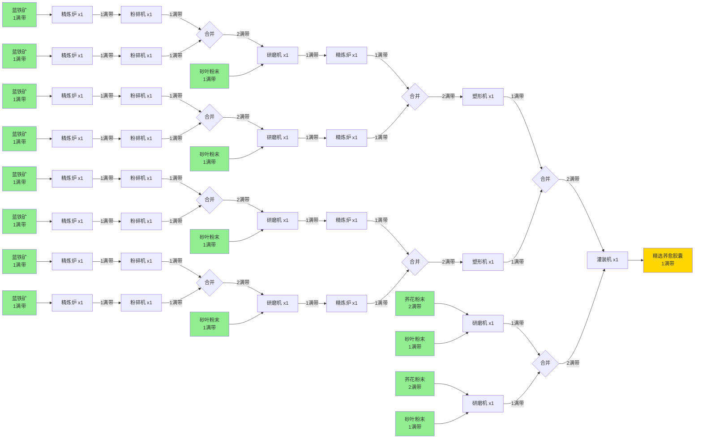

# 精选荞愈胶囊生产线示例

## 生产目标

一个`灌装机`满速生产`精选荞愈胶囊`

## 需求分析

### 直接输入（灌装机）
- 输入：2满带`钢制瓶` + 2满带`细磨荞花粉末`
- 输出：1满带`精选荞愈胶囊`

## 生产链路图

## 建筑清单

| 建筑类型 | 数量 | 用途 |
|---------|------|------|
| 灌装机 | 1 | 生产精选荞愈胶囊 |
| 研磨机 | 6 | 2个生产细磨荞花粉末 4个生产致密蓝铁粉末 |
| 塑形机 | 2 | 生产钢制瓶 |
| 精炼炉 | 12 | 4个生产钢块 8个生产蓝铁块 |
| 粉碎机 | 8 | 生产蓝铁粉末 |
| **总计** | **29** | |

## 原料需求

| 原料名称 | 需求量 |
|---------|--------|
| 蓝铁矿 | 8满带 |
| 荞花粉末 | 4满带 |
| 砂叶粉末 | 6满带 |

## 中间产物流量

| 产物名称 | 流量 |
|---------|------|
| 蓝铁块 | 8满带 |
| 蓝铁粉末 | 8满带 |
| 致密蓝铁粉末 | 4满带 |
| 钢块 | 4满带 |
| 钢制瓶 | 2满带 |
| 细磨荞花粉末 | 2满带 |

## 优化目标

在给定上述29个建筑的情况下，寻找最紧凑的布局方案，使得：
1. 所有建筑都能被电力塔覆盖
2. 占用的地图面积最小
3. 电力塔数量尽可能少
