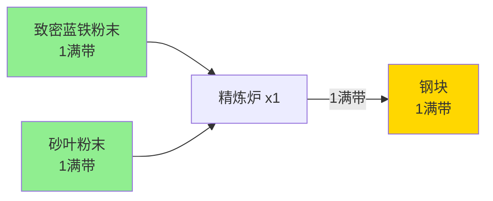

# 钢块生产线示例（1满带）

## 生产目标

生产1满带的钢块作为验证示例。

## 需求分析

### 生产要求
- 1个精炼炉可以生产1满带钢块
- 需要输入1满带致密蓝铁粉末和1满带砂叶粉末

## 生产链路图

## 建筑清单

| 建筑类型 | 数量 | 用途 |
|---------|------|------|
| 精炼炉 | 1 | 生产钢块 |
| **总计** | **1** | |

## 原料需求

| 原料名称 | 需求量 |
|---------|--------|
| 致密蓝铁粉末 | 1满带 |
| 砂叶粉末 | 1满带 |

## 游戏机制说明

### 建筑尺寸

| 建筑类型 | 尺寸 (宽×长) | 输入/输出口数量 |
|---------|-------------|----------------|
| 精炼炉 | 3×3 | 3个输入口 + 3个输出口 |
| 传送带 | 1×1 | 1个输入口 + 1个输出口 |

**规则**：
- 精炼炉尺寸为 **3×3**
- 传送带尺寸为 **1×1**
- 传送带占用地图空间，需要在SAT求解中考虑

### 连接规则

#### 直接连接
- ❌ **机器的输入输出口直接相邻不被视为有效连接**
- ✅ 机器之间需要通过传送带连接

#### 传送带
- 占地：**1×1**
- 每条传送带有一个**输入方向**和一个**输出方向**（必须不同）
- 用于在机器之间传输物品
- 传送带也是建筑，需要占用网格空间

## 优化目标

在给定1个精炼炉的情况下，寻找最紧凑的布局方案，使得：
1. 所有建筑（包括传送带）正确放置
2. 传送带正确连接输入源和机器、机器和输出
3. 占用的地图面积最小
