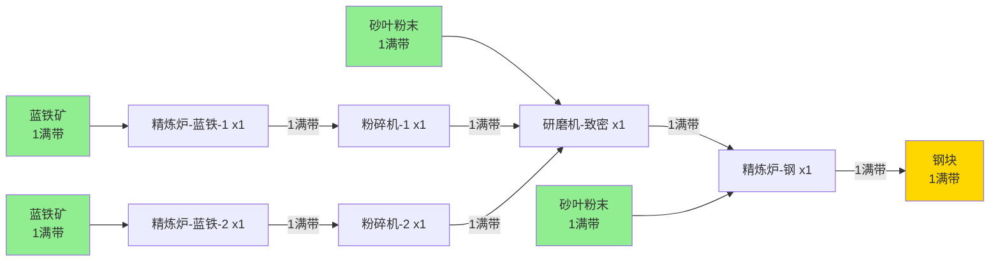

# 钢块生产线示例（1满带）

## 生产目标

从原料（蓝铁矿和砂叶粉末）开始，生产1满带的钢块。

## 需求分析

### 完整生产链

为了生产1满带钢块，需要以下生产链：

1. **钢块生产**（最终产品）
   - 1个精炼炉生产钢块
   - 输入：1满带致密蓝铁粉末 + 1满带砂叶粉末
   - 输出：1满带钢块

2. **致密蓝铁粉末生产**
   - 1个研磨机生产致密蓝铁粉末
   - 输入：2满带蓝铁粉末 + 1满带砂叶粉末
   - 输出：1满带致密蓝铁粉末

3. **蓝铁粉末生产**
   - 2个粉碎机生产蓝铁粉末（每个1满带）
   - 输入：各1满带蓝铁块
   - 输出：共2满带蓝铁粉末

4. **蓝铁块生产**（从原料开始）
   - 2个精炼炉生产蓝铁块（每个1满带）
   - 输入：各1满带蓝铁矿（原料）
   - 输出：共2满带蓝铁块

## 生产链路图

## 建筑清单

| 建筑类型 | 数量 | 用途 |
|---------|------|------|
| 精炼炉 | 3 | 2个生产蓝铁块，1个生产钢块 |
| 研磨机 | 1 | 生产致密蓝铁粉末 |
| 粉碎机 | 2 | 生产蓝铁粉末 |
| **总计** | **6** | |

## 原料需求

| 原料名称 | 需求量 |
|---------|--------|
| 蓝铁矿 | 2满带 |
| 砂叶粉末 | 2满带 |

## 中间产物流量

| 产物名称 | 流量 |
|---------|------|
| 蓝铁块 | 2满带 |
| 蓝铁粉末 | 2满带 |
| 致密蓝铁粉末 | 1满带 |

## 游戏机制说明

### 建筑尺寸

| 建筑类型 | 尺寸 (宽×长) | 输入/输出口数量 |
|---------|-------------|----------------|
| 精炼炉 | 3×3 | 3个输入口 + 3个输出口 |
| 研磨机 | 3×6 | 6个输入口 + 6个输出口 |
| 粉碎机 | 3×3 | 3个输入口 + 3个输出口 |
| 传送带 | 1×1 | 1个输入口 + 1个输出口 |

**规则**：
- 精炼炉和粉碎机尺寸为 **3×3**
- 研磨机尺寸为 **3×6**
- 传送带尺寸为 **1×1**
- 传送带占用地图空间，需要在SAT求解中考虑

### 连接规则

#### 直接连接
- ❌ **机器的输入输出口直接相邻不被视为有效连接**
- ✅ 机器之间需要通过传送带连接

#### 传送带
- 占地：**1×1**
- 每条传送带有一个**输入方向**和一个**输出方向**（必须不同）
- 用于在机器之间传输物品
- 传送带也是建筑，需要占用网格空间

## 优化目标

在给定6个建筑的情况下，寻找最紧凑的布局方案，使得：
1. 所有建筑（包括传送带）正确放置
2. 传送带正确连接原料输入、中间产物和最终输出
3. 占用的地图面积最小
